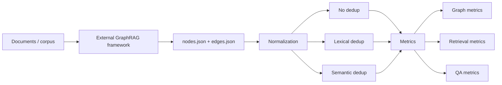

<<<<<<< HEAD
# GraphRAG Dedup Evaluation Pipeline

Evaluation pipeline for studying how deduplication affects GraphRAG-style systems such as **HiRAG**, **LightRAG**, and **Fast GraphRAG**.

## Motivation

Graph-based RAG systems often accumulate duplicate entities and relations because of noisy extraction, chunk overlap, alias variation, and repeated fact discovery across documents. This can lead to:

- inflated graph size
- fragmented knowledge representation
- weaker retrieval due to evidence being split across near-duplicate nodes
- redundant or less grounded answers

This repository focuses on the **evaluation layer** for that problem. It provides a reproducible way to compare **no deduplication**, **lexical deduplication**, and **semantic deduplication** on exported graphs from external GraphRAG frameworks.

## What this repository does

- normalizes graph exports to a unified schema
- applies lexical deduplication
- applies semantic deduplication
- computes graph-level metrics
- computes retrieval metrics
- computes QA metrics
- runs sample and real-data experiment flows

## What this repository does not do

This repository **does not reimplement** HiRAG, LightRAG, or Fast GraphRAG themselves. Instead, it consumes graph exports produced by those systems.

## Experimental design

The intended benchmark compares:

- **Frameworks:** HiRAG, LightRAG, Fast GraphRAG
- **Modes:** `no_dedup`, `lexical`, `semantic`
- **Evaluation levels:** graph structure, retrieval quality, QA quality



## Repository structure

```text
.
├── config/
├── data/
├── docs/
├── example_exports/
├── results/
├── scripts/
├── src/graphrag_dedup/
├── IMPLEMENTED.md
├── LICENSE
├── README.md
└── requirements.txt
```

## Quick start

### 1. Install dependencies

Windows:

```bash
py -3.14 -m pip install -r requirements.txt
```

Generic:

```bash
python -m pip install -r requirements.txt
```

### 2. Run the sample experiment

Windows:

```bash
py -3.14 scripts/run_sample_experiment.py
```

Generic:

```bash
python scripts/run_sample_experiment.py
```

Results are written to `results/sample_run/`.

## Sample outputs already included

This repository includes a generated sample run with:

- `results/sample_run/graph_metrics.csv`
- `results/sample_run/retrieval_metrics.csv`
- `results/sample_run/qa_metrics.csv`
- `results/sample_run/plot_nodes.png`
- `results/sample_run/plot_recall5.png`
- `results/sample_run/plot_rougel.png`

## Example sample-run results

These are sample numbers from the bundled toy experiment and are included only to demonstrate the pipeline structure.

| Framework | Mode | Nodes | Node DRR | Recall@5 | ROUGE-L |
|---|---:|---:|---:|---:|---:|
| HiRAG | no_dedup | 8 | 0.000 | 0.5556 | 0.4758 |
| HiRAG | semantic | 4 | 0.500 | 0.4444 | 0.4758 |
| LightRAG | no_dedup | 8 | 0.000 | 0.6667 | 0.5234 |
| LightRAG | semantic | 5 | 0.375 | 0.5556 | 0.5270 |
| Fast GraphRAG | no_dedup | 7 | 0.000 | 0.4444 | 0.4758 |
| Fast GraphRAG | semantic | 4 | 0.4286 | 0.2222 | 0.2424 |

## Real-data workflow

### Expected directory structure

```text
results/real_run/exports/
├── hirag/no_dedup/
│   ├── nodes.json
│   └── edges.json
├── lightrag/no_dedup/
│   ├── nodes.json
│   └── edges.json
└── fastrag/no_dedup/
    ├── nodes.json
    └── edges.json
```

### Run the real experiment

Windows:

```bash
py -3.14 scripts/run_real_experiment.py --input-root results/real_run/exports --output-root results/real_run
```

Generic:

```bash
python scripts/run_real_experiment.py --input-root results/real_run/exports --output-root results/real_run
```

## Unified schema

### `nodes.json`

```json
[
  {
    "node_id": "n1",
    "name": "Aspirin",
    "type": "Drug",
    "aliases": ["aspirin", "acetylsalicylic acid"],
    "source_chunks": ["c1", "c2"],
    "framework": "hirag",
    "dedup_mode": "no_dedup"
  }
]
```

### `edges.json`

```json
[
  {
    "edge_id": "e1",
    "source": "n1",
    "target": "n2",
    "relation": "treats",
    "source_chunks": ["c3"],
    "framework": "hirag",
    "dedup_mode": "no_dedup"
  }
]
=======
# GraphRAG Dedup Eval

Evaluation pipeline for studying the effect of deduplication in GraphRAG-style systems.

## Overview

This repository contains an evaluation pipeline for deduplication experiments in graph-based retrieval-augmented generation systems. The project is designed to support graph exports from frameworks such as HiRAG, LightRAG, and Fast GraphRAG.

The pipeline includes:
- graph normalization to a unified schema
- lexical deduplication
- semantic deduplication
- graph-level metrics
- retrieval metrics
- QA evaluation
- sample experiment scripts and outputs

## Repository structure

- `src/` — core implementation
- `scripts/` — experiment runners
- `config/` — configuration files
- `data/` — sample data
- `results/` — sample outputs
- `IMPLEMENTED.md` — summary of implemented components

## Current status

Implemented:
- unified graph schema
- lexical deduplication module
- semantic deduplication module
- graph metrics
- retrieval metrics
- QA metrics
- sample experiment pipeline

In progress:
- integration with real graph exports from HiRAG, LightRAG, and Fast GraphRAG

Planned:
- full-scale experiments on the target domain dataset
- extended ablation study for deduplication strategies

## How to run

Install dependencies:

```bash
py -3.14 -m pip install -r requirements.txt
>>>>>>> 5b51057dc60337cc59a1b1eba1ed2caa966ab00a
```

## Metrics covered

### Graph-level metrics

- node count
- edge count
- average degree
- connected components
- density
- duplicate names remaining
- duplicate edges remaining
- duplicate reduction rate (DRR)

### Retrieval metrics

- Recall@k
- Precision@k
- HitRate@k
- MRR

### QA metrics

- Exact Match
- Token F1
- ROUGE-L
- Answer Redundancy
- Grounding Proxy

## Current status

Implemented:

- unified graph schema
- lexical deduplication
- semantic deduplication
- graph metrics
- retrieval metrics
- QA metrics
- sample experiment runner
- real-data experiment runner
- normalization helper for external exports

In progress:

- integration with real graph exports from HiRAG, LightRAG, and Fast GraphRAG
- larger-scale experiments on the target corpus

Planned:

- ontology-aware deduplication
- more robust semantic matching strategies
- extended ablation studies across domains

## Limitations

- depends on the quality of upstream graph extraction
- semantic deduplication quality depends on embeddings and matching thresholds
- sample results are illustrative and not intended as final benchmark claims
- retrieval and QA evaluation quality depends on the quality of the provided gold data

## Useful entry points

- `scripts/run_sample_experiment.py`
- `scripts/run_real_experiment.py`
- `scripts/normalize_graph_export.py`
- `config/experiment.yaml`
- `IMPLEMENTED.md`
- `docs/EXPERIMENT_DESIGN.md`

## License

MIT
